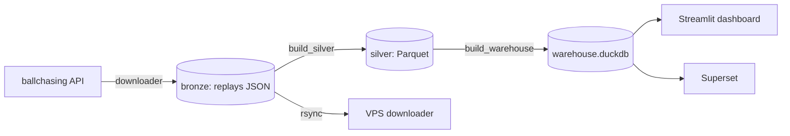

# Agents.md

Guidance for AI coding agents working in this repository (Rocket League Analyzer).

## Project overview

Collects Rocket League replays from the ballchasing.com API into a local data lake, processes them through a medallion architecture (bronze → silver → gold), and serves dashboards and analytics.

Data flow:



## Commands

Use `python3` (there is no `python` in PATH). Activate `.venv` when working locally.

```bash
# Bronze: download replays from the API into the data lake (required: --data-dir)
python3 scripts/download.py --data-dir data

# Silver: ETL bronze JSON → Parquet (partitioned by season/playlist/tier)
python3 scripts/build_silver.py --data-dir data

# Gold: materialize DuckDB warehouse (replays, players + v_* views)
python3 scripts/build_warehouse.py --data-dir data

# Streamlit dashboard
streamlit run app/app.py                       # dev
streamlit run app/app.py --server.headless true --server.port 8501

# Tests
python3 -m pytest tests/

# Sync data from the VPS downloader (rsync)
bash scripts/sync_local.sh

# Airflow stack (from airflow/ directory)
docker compose up -d
```

## Project structure

- `src/` — core library (imported as `src.*`)
  - `src/downloader.py` — downloader engine
  - `src/silver.py` — bronze→silver ETL (DuckDB)
  - `src/ballchasing_api.py` — API client / token handling
  - `src/state.py`, `src/storage.py`, `src/analyzer.py`, `src/constants.py`, `src/main.py`
- `scripts/` — CLI entry points (`download.py`, `build_silver.py`, `build_warehouse.py`, `sync_local.sh`, `setup_vps.sh`)
- `app/` — Streamlit dashboard (`app.py` + `pages/1_Populacao.py`, `pages/2_Validacao.py`, `queries.py`, `audit.py`, `theme.py`)
- `config/download.yaml` — downloader configuration
- `airflow/` — Airflow 3 stack (DAG `sync_from_vps`, Dockerfile, docker-compose.yaml, entrypoint.sh)
- `data/` — data lake (gitignored): `replays/`, `manifests/`, `parquet/`, `warehouse.duckdb`, `state.json`
- `models/` — trained scikit-learn models (`ranked-*.joblib`)
- `tests/test_api.py` — API client tests

## Conventions

- Python 3, `requirements.txt` (UTF-8). Key deps: `duckdb`, `httpx`, `requests`, `streamlit`, `pandas`, `plotly`, `scikit-learn`, `PyYAML`.
- Imports: modules insert repo root into `sys.path` to import `app.*` and `src.*`.
- Dashboard modules use `width="stretch"` (NOT the deprecated `use_container_width`).
- Aggregate dashboards by season/playlist/rank — never list per-bucket (264 buckets is too many).
- Data lake layout: `data/replays/season=<s>/playlist=<p>/tier=<t>/<id>.json` with `data/manifests/.../manifest.json` and `data/state.json`.
- Tier indexing: bronze uses 0-based folder index; silver uses the API's 1-based `min_rank.tier` (bronze tier=7 ↔ silver tier=8).
- File writes are atomic (tmp + rename). `state.json`/manifests persisted; handle SIGINT/SIGTERM gracefully.

## Gotchas

- **Security:** never commit secrets, IPs, users, or SSH key paths. All secrets go through `airflow/.env` (gitignored, pattern `.env`); `.env.example` holds placeholders. The API token is resolved from the `BALLCHASING_TOKEN` env var (fallback `TEST_TOKEN`) — do not pass tokens as parameters.
- **Airflow 3.3.1:** `airflow webserver` was removed (use `airflow api-server`); API is `/api/v2`; DAGs start paused (`airflow dags unpause`); worker needs `AIRFLOW__API__BASE_URL` + shared `AIRFLOW__API_AUTH__JWT_SECRET` or every task fails with ConnectError/invalid auth token. Debug real errors in `docker logs airflow-worker-1` or the metadata DB — the task log often only shows `::group::Pre Execute`.
- **Airflow mounts:** data lake is mounted as `../data:/opt/data` (repo root), not `./data`. Use rsync `-r` (not `-a`) — the container runs as uid 50000 and cannot set perms/times on uid 1000 files (exit 23).
- **Downloader pagination:** keep `sort_by: replay-date` + `sort_dir: asc`; paginate by cursor (`replay-date-after`), never by page (page returns overlapping results). Rate limiting uses continuous spacing (`interval = 3600/per_hour`), NOT a sliding window.
- **Dead replays:** IDs failing `skip_after_failures` (default 5) consecutive times are marked `skipped` in the manifest to stop retrying.
- **DuckDB:** create output directories before `COPY ... (PARTITION_BY, OVERWRITE_OR_IGNORE)` — DuckDB does not create them.
- **requirements.txt** must stay UTF-8 (UTF-16 breaks pip).
- VPS runs the downloader 24/7 via systemd service `rl-download` (data dir `/home/ubuntu/rl_analyzer/data`); stop/start with `sudo systemctl`.

## Testing

- `tests/test_api.py` exercises `src/ballchasing_api.py`. Keep API calls mocked — do not hit the real API or burn quota.
- After editing, verify there are no syntax/import errors (a common failure is `create_file` writing a filename with a trailing newline, which breaks imports).
